# MYPHARMA: A Pharmacy For All Your Needs

“Everything in life is uncertain. That is how you know you are existing in the world, the uncertainty. Of course, this is why we sometimes want to return to the past, because we know it, or think we do. It's a song we've heard.” We, being humans can get into an emergency condition, where there can be a requirement of instant medical attention. Since hospitals are not accessible to everyone in their proximity so sometimes getting proper medicine or proper first aid at the right time can prove to be life saviour. We are living in the 20th Century and have the comfort of ordering anything just while sitting at home. But the problem with all the current medicine delivery apps is that they have speculated delivery time and usually take more than 1 day to deliver the medicines. If there is an emergency condition, we are forced to wander in search of medical stores near our home and this is where our application comes into the picture.

We designed a system by using an object oriented paradigm where all the medical stores are present on the single platform. We have implemented this by forming several classes, each of them working is explained below. Basically we try to buit a real and user friendly application. The In this We have implemented an actionListner interface so that we can perform certain actions when clicking the buttons and design the action by overriding the actionPerformed method of actionListener interface. Inorder to design the panel and setting background images adjusted with margin we used swing library in java by importing javax.swing.* .We have used sql as well so that we can store the entered entries by including jar files which works as a jdbc driver.

## Data Base
- Total Tables

-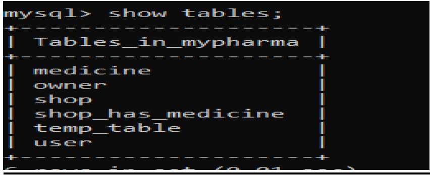

-	Shop Owner

-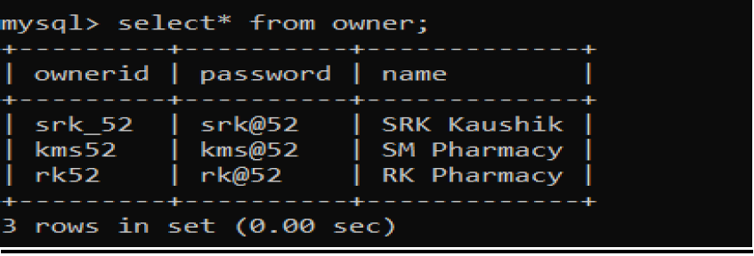

-   User

-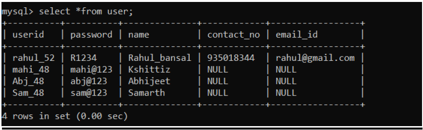

-   Medicine

-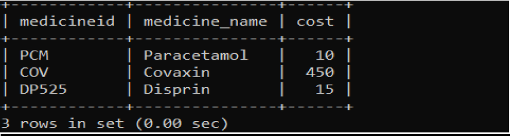

-   Shop

-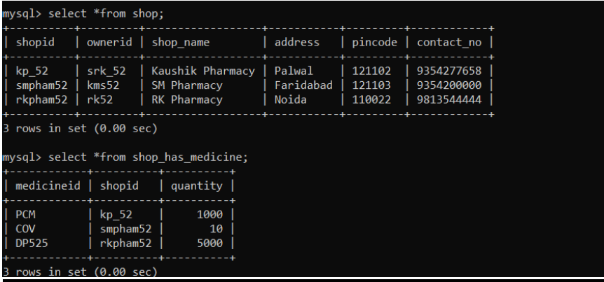

-   shop has medicine 

-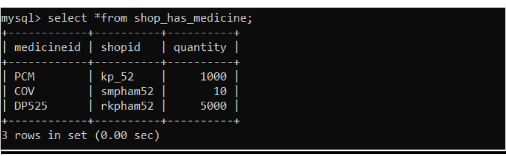

## Highlights
-   HomePage

-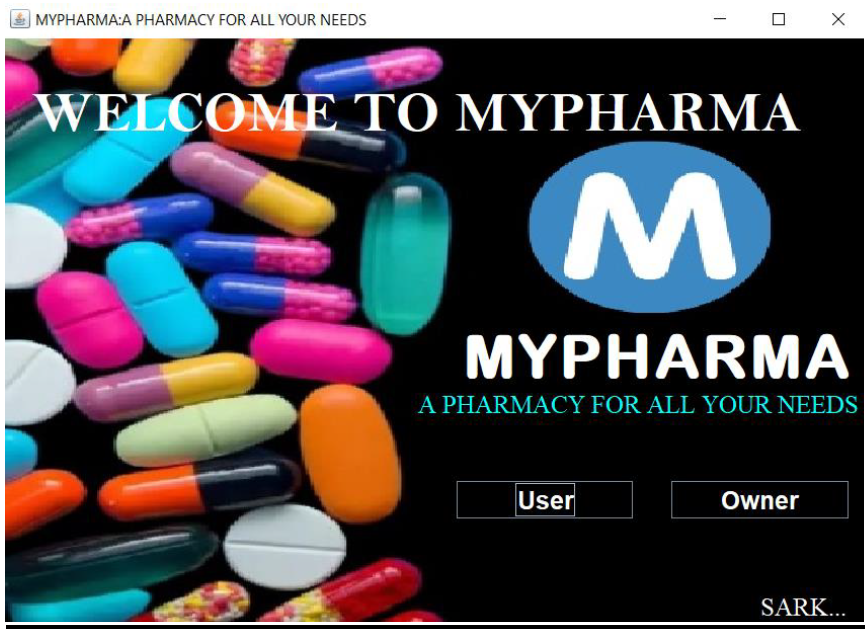

-   User Login

-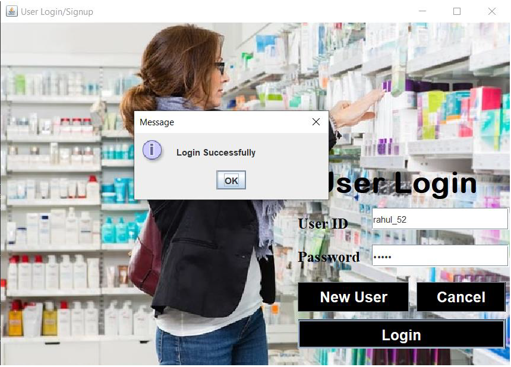

-   User Signup

-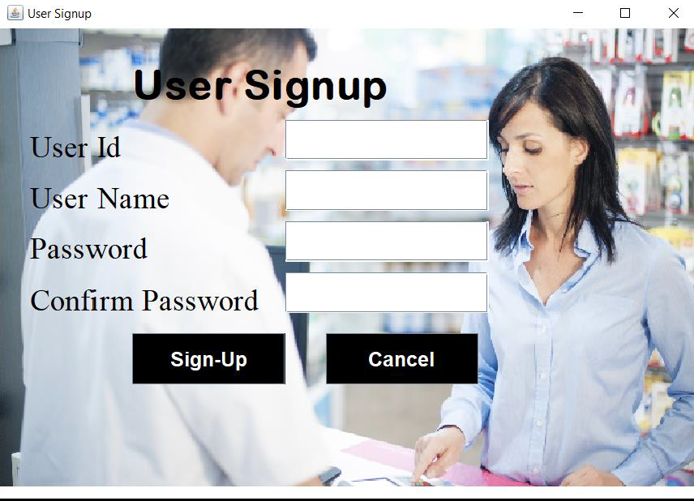

-   Owner Login

-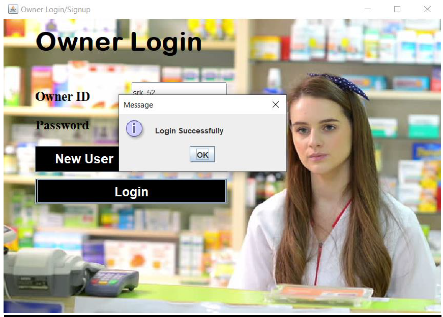

-   Owner Signup

-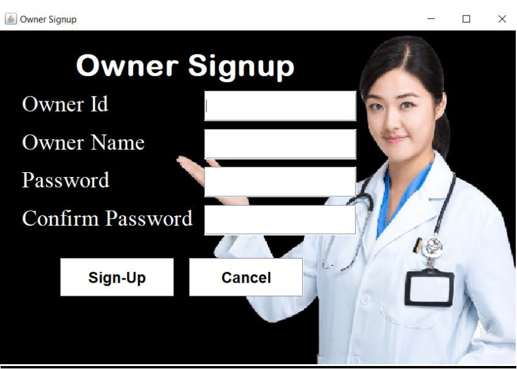

-   User Dashboard

-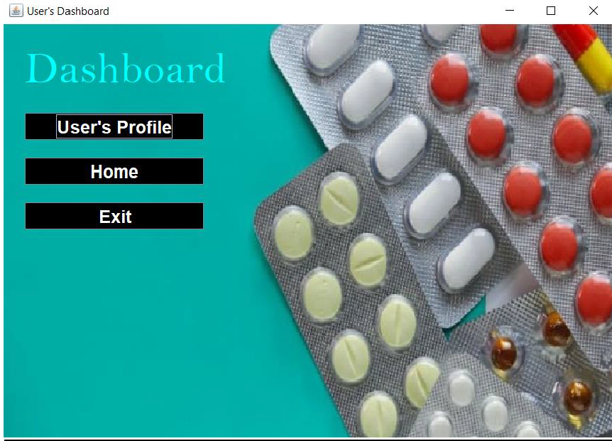

-   Owner Dashboard

-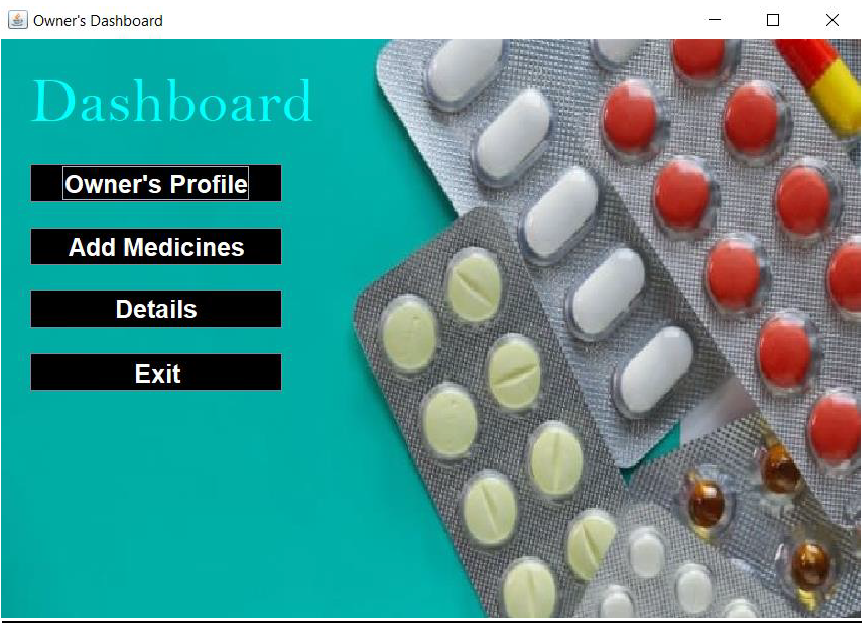

-   Owner Profile Complete

-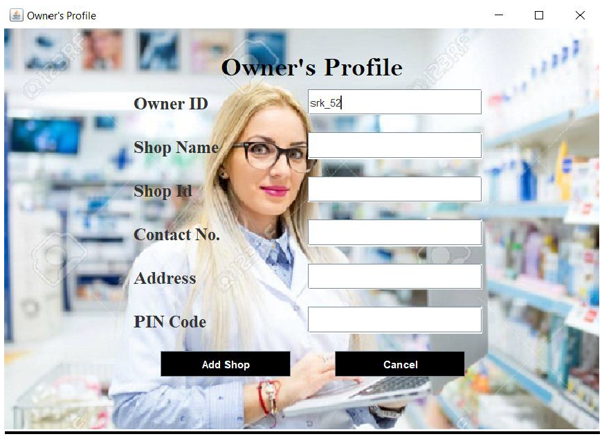

-   Add Medicine

-

-   All Medicine 

-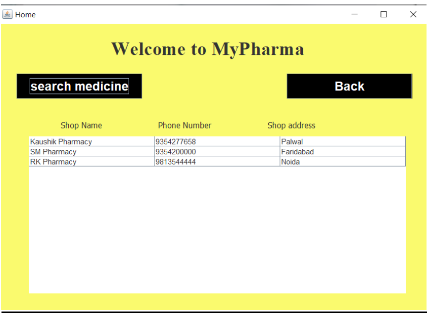

-   Search Medicine

-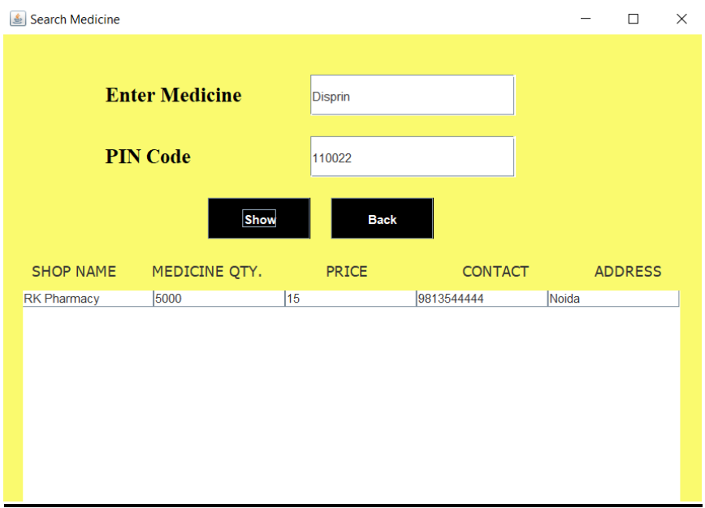
