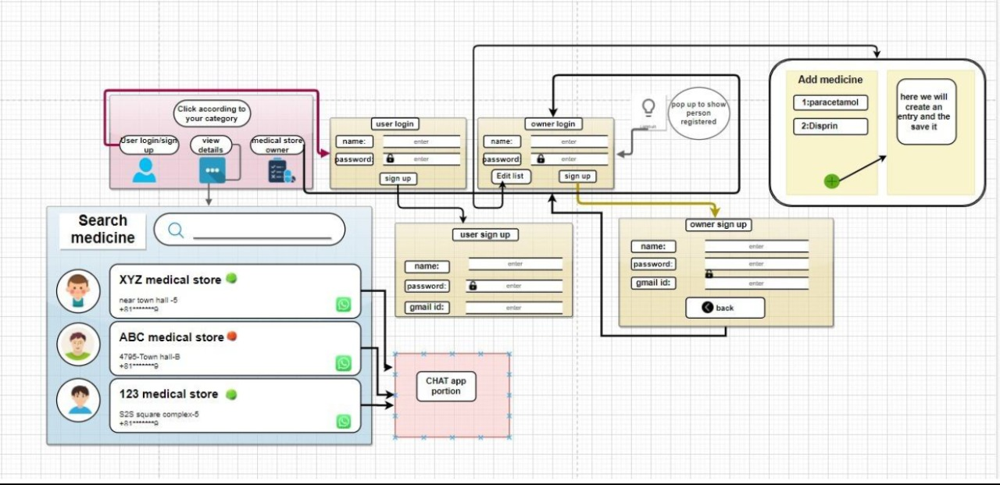
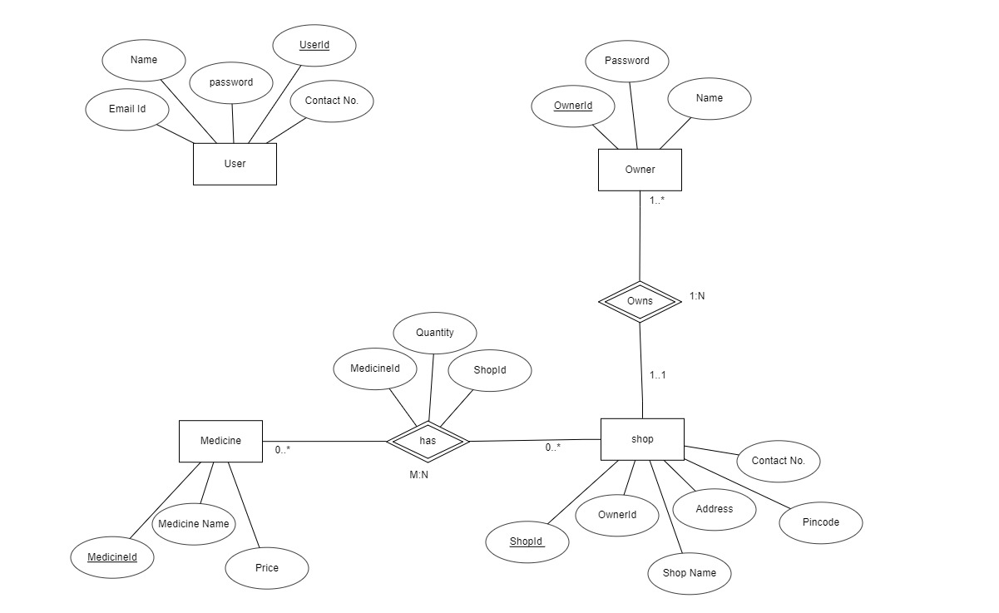

# MYPHARMA: A Pharmacy For All Your Needs

- We have designed a system by using an object oriented paradigm where all the medical stores are present on the single platform. 

- We have implemented this by forming several classes, each of them working can be understood by the screenshots below.

- We have tried to build a user friendly application. We have implemented an actionListner interface so that we can perform certain actions when clicking the buttons.

- Inorder to design the panel and setting background images adjusted with margin we used swing library in java.

- We have used sql to store the entered entries by including jar files which works as a jdbc driver.

## Goals
-   End User
    1.  The user will be able to get the details of nearby medical 
        stores after signing up / logging in to the portal.
    2.  The user will be able to add up their query of a particular 
        medicine.

-   Medical Store Owner
    1.  The shop owner will be able to get the details of the medical 
        requirements of the people after signing up / logging in to the 
        portal.
    2.  After signup/login owner will be able to add/edit medicines 
        available at his store.

## Highlights
- Flowchart

-

- Entity-Relationship Diagram

-

-   HomePage

-

-   User Login

-

-   User Signup

-

-   Owner Login

-

-   Owner Signup

-

-   User Dashboard

-

-   Owner Dashboard

-

-   Owner Profile Complete

-

-   Add Medicine

-

-   All Medicine 

-

-   Search Medicine

-

## DataBase
- Total Tables

-

-	Shop Owner

-

-   User

-

-   Medicine

-

-   Shop

-

-   shop has medicine 

-

